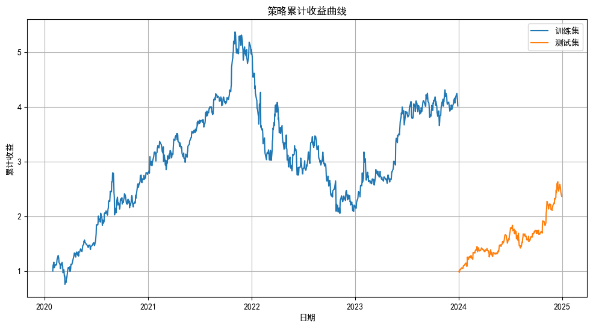
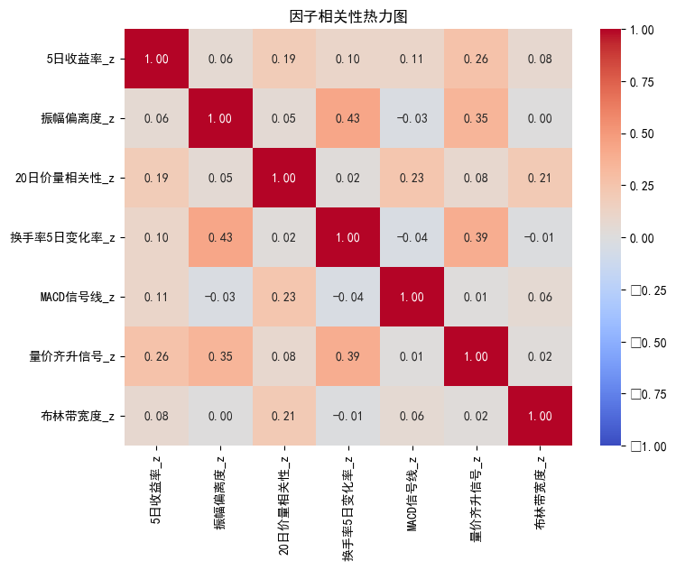

# 5210 assignment

[](https://github.com/akfamily/akshare)

## 数据 & 因子

数据来源：akshare

数据内容：获取股票对象为微软（MSFT）、谷歌（GOOGL）、苹果（AAPL）、脸书（META）、亚马逊（AMZN）、英伟达（NVDA）和特斯拉（TSLA）

数据区间：2020年1月1日至2024年12月31日。2020年至2023年为测试集，2024年为训练集

数据字段：`日期`、`开盘`、`收盘`、`最高`、`最低`、`成交量`、`振幅`、`涨跌幅`、`换手率`、`股票代码`

因子类型：动量因子、波动率因子、成交量/流动性因子、技术指标类因子、价量复合因子、均值回归因子。经过筛选，选取了部分因子作为模型因子。通过 `factors` 控制因子选取

1. 5日收益率

```py
full_df["5日收益率"] = full_df.groupby("股票代码")["收盘"].transform(
    lambda x: x.pct_change(5)
)
```

2. 振幅偏离度

```py
full_df["振幅偏离度"] = full_df["振幅"] / full_df.groupby("股票代码")["振幅"].transform(
    lambda x: x.rolling(20).mean()
) - 1
```

3. 20日价量相关性

```py
full_df["20日价量相关性"] = full_df.groupby("股票代码").apply(
    lambda x: x["收盘"].rolling(20).corr(x["成交量"])
).reset_index(level=0, drop=True)
```

4. 换手率5日变化率

```py
full_df["换手率5日变化率"] = full_df.groupby("股票代码")["换手率"].transform(
    lambda x: x.pct_change(5)
)
```

5. MACD信号线

```py
full_df["EMA12"] = full_df.groupby("股票代码")["收盘"].transform(
    lambda x: x.ewm(span=12).mean()
)
full_df["EMA26"] = full_df.groupby("股票代码")["收盘"].transform(
    lambda x: x.ewm(span=26).mean()
)
full_df["MACD"] = full_df["EMA12"] - full_df["EMA26"]
full_df["MACD信号线"] = full_df.groupby("股票代码")["MACD"].transform(
    lambda x: x.ewm(span=9).mean()
)
```

6. 量价齐升信号

```py
full_df["量价齐升信号"] = (
    (full_df["涨跌幅"] > 0) & 
    (full_df["成交量"] > full_df.groupby("股票代码")["成交量"].transform(
        lambda x: x.rolling(5).mean()
    ))
).astype(int)
```

7. 布林带宽度

```py
full_df["20日均线"] = full_df.groupby("股票代码")["收盘"].transform(
    lambda x: x.rolling(20).mean()
)
full_df["布林带宽度"] = (
    full_df.groupby("股票代码")["收盘"].transform(
        lambda x: x.rolling(20).std()
    ) * 2
) / full_df["20日均线"]
```

## 因子表现



训练集绩效:
```
夏普比率: 1.00
IC均值: -0.0035, IR: -0.0079
```

测试集绩效:
```
夏普比率: 2.20
IC均值: 0.0073, IR: 0.0156
```



训练集因子绩效:
```
5日收益率: IC=-0.0042, IR=-0.0097
振幅偏离度: IC=-0.0014, IR=-0.0033
20日价量相关性: IC=-0.0092, IR=-0.0217
换手率5日变化率: IC=0.0148, IR=0.0343
MACD信号线: IC=0.0035, IR=0.0085
量价齐升信号: IC=-0.0093, IR=-0.0213
布林带宽度: IC=-0.0111, IR=-0.0248
```

测试集因子绩效:
```
5日收益率: IC=-0.0041, IR=-0.0099
振幅偏离度: IC=0.0098, IR=0.0240
20日价量相关性: IC=-0.0582, IR=-0.1357
换手率5日变化率: IC=0.0183, IR=0.0422
MACD信号线: IC=0.0006, IR=0.0013
量价齐升信号: IC=0.0539, IR=0.1218
布林带宽度: IC=0.0132, IR=0.0295
```

综合因子绩效:
```
训练集: IC=-0.0035, IR=-0.0079
测试集: IC=0.0073, IR=0.0156
```

## 结果分析 & 改进

- ​​训练集失效​​：所有单因子和综合因子在训练集的IC均值为负（综合因子IC=-0.0035），说明​​因子逻辑与历史收益方向背离​​。
- ​​测试集局部有效​​：部分因子（如量价齐升信号、换手率变化率）在测试集IC转正，但绝对值仍低（IC=0.05），属于​​弱有效性​​。
- 收益-风险不匹配​​：测试集累计收益后期上升但波动小，可能是幸存者偏差或市场风格切换的偶发结果

可能归因：

- 动量类因子（5日收益率）​​：2020-2023年美股经历疫情牛熊快速切换（2020年3月熔断→2021年泡沫→2022年加息暴跌→2023年AI反弹），传统动量因子易双向失效。
- 技术指标（MACD）​​：在美联储政策主导的宏观环境中，技术指标易被基本面冲击覆盖。

改进方向：

- 因子层面加入宏观适应性因子，增强策略对市场环境的适应性
- 风险控制方面，在市场波动率较大的时候暂停交易（如VIX>30），增加股票范围，避免科技行业集体风险暴露